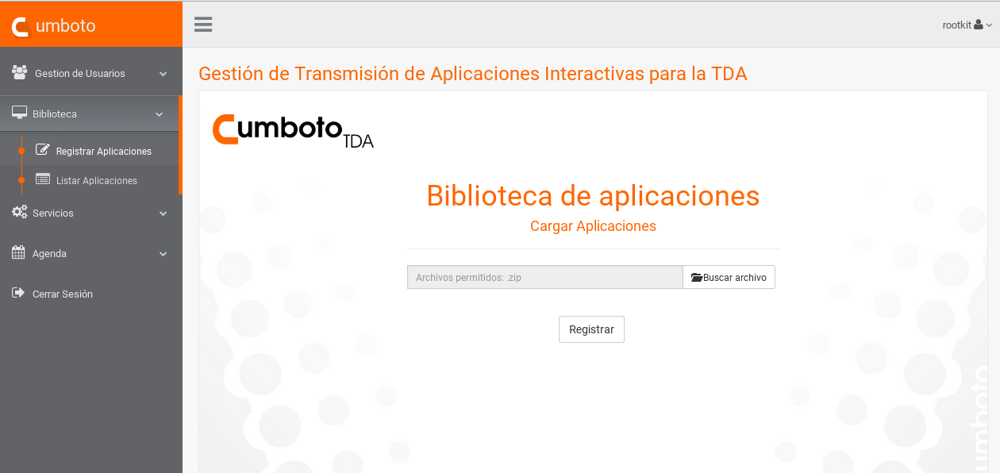
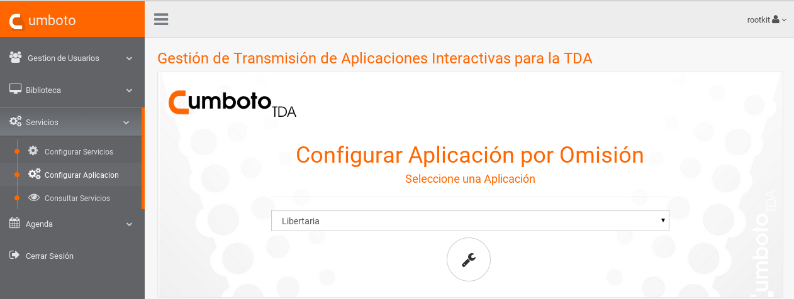
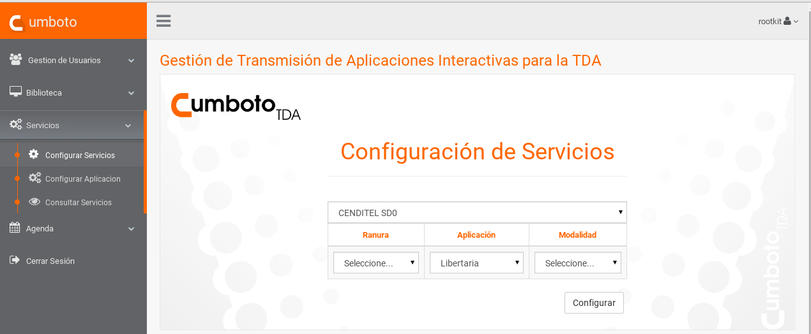
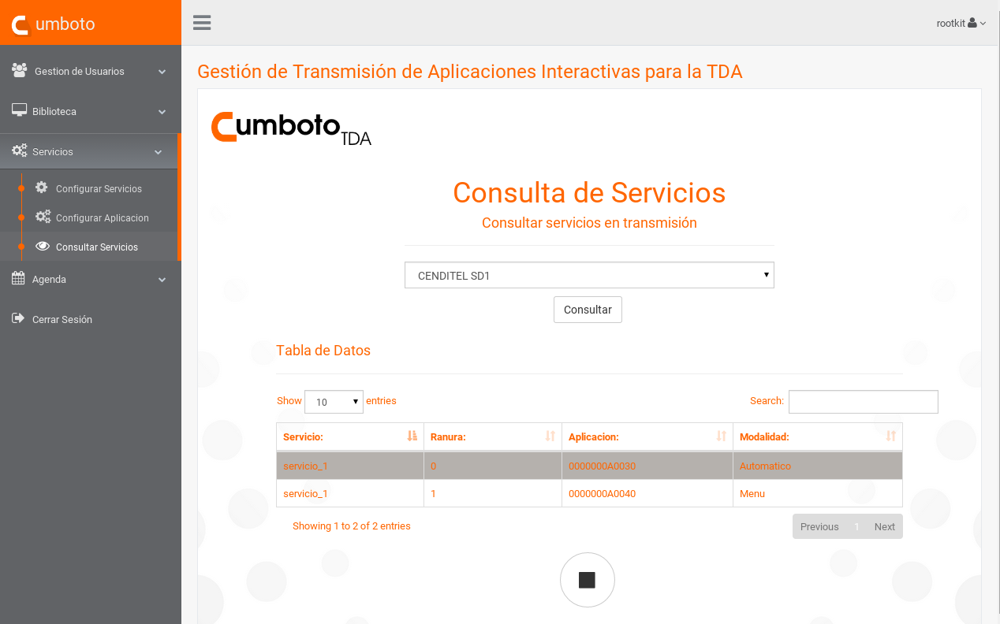

# Televisión Digital Abierta Flujo de Transporte - Cumboto

### Cumboto TDA

Es un sistema que controla y gestiona la transmisión de aplicaciones interactivas desde la sala de control maestro de una estación de televisión. Es decir, permite controlar de forma sencilla y expedita la transmisión del contenido interactivo de un canal de Televisión Digital Abierta (TDA). Esta basado en un servicio de API REST con el Django Rest-Framework que permite crear servicios y aplicaciones que pueden ser usadas por cualquier dispositivo o cliente que entienda el estándar HTTP. Es una arquitectura de cliente-servidor. Por tal motivo el sistema Cumboto esta constituido por tres servicios o capas: Front-End (Capa Interfaz) el cual se comunica directamente con el cliente, la API Back-end (Capa de Enlace) la cual atiende las solicitudes por el cliente para ser ejecutada en el servidor transmisión.

> Funcionalidades:
> - Gestión de Usuarios.
> - Registrar, listar y eliminar aplicaciones interactivas dinámicas o estáticas.
> - Transmitir aplicaciones interactivas de forma emergente por un servicio de la TDA.
> - Consultar los servicios en transmisión.
> - Construir y consultar agenda de programación de la transmisión de las aplicaciones interactivas.
>

### **Template:** *biblioteca de aplicaciones* 

### **Template:** *Configurar Aplicación por Omisión* 

### **Template:** *Configuración de servicios* 

### **Template:** *Consulta de servicios* 

